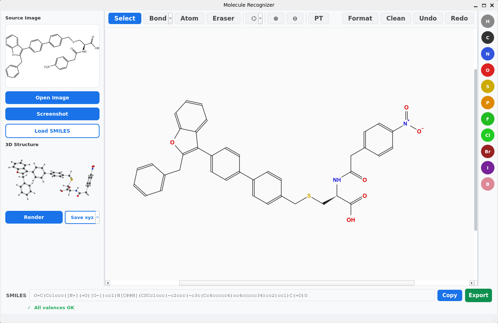

# Molecule Recognizer

Recognize molecular structures from images (screenshots, papers, web pages), convert them to SMILES strings, interactively edit the recognized structure, and save the 3D structure in xyz format. Built for computational chemistry workflows.

**Current working version: 0.3.0** — Windows portable packaging with bundled OSRA, alongside the Linux/Python application. The Windows binary release is not yet published; see [Windows usage](#windows-usage) for its status. Earlier releases are listed in the [changelog](CHANGELOG.md).



Double-click the rendered XYZ preview to compare it beside the 2D canvas.
Drag the divider to adjust the view widths; the editor and SMILES remain
interactive. Close the 3D panel to return to the full canvas.

## Start here

- [Windows usage](#windows-usage) — portable EXE, native PowerShell/Conda, or optional WSLg.
- [Linux usage](#linux-usage) — OSRA setup, Python installation and desktop capture.
- [Common workflow and controls](#common-workflow-and-controls) — recognition, editing and XYZ export.
- [OSRA configuration](#osra-configuration) · [Python API](#python-api) · [Features](#features)

## Windows usage

### Portable EXE — no Python, Conda or WSL required

**Release status:** the OSRA-inclusive **0.3.0** Windows ZIP has been built,
validated and initially tested by the owner, but has **not yet been published**
as a GitHub Release. The published v0.2.0 does not include a standalone EXE.
The steps below apply to the prepared ZIP and to the download once published;
do not use GitHub's automatic “Source code” ZIP as the runnable application.

1. Obtain `MolRecognizer-0.3.0-windows-x64.zip`. After publication, it will be
   available from [GitHub Releases](https://github.com/Hengyuan1/molecule-recognizer/releases).
2. Extract the **entire ZIP** into a short, permanent, user-writable folder,
   such as `C:\Users\YourName\Apps`. Avoid deeply nested folders.
3. Open `MolRecognizer.exe` inside the extracted `MolRecognizer` folder.
   Keep `_internal`, `tools`, the worker EXE and all other companion files
   together; copying only the main EXE will not work.
4. Optionally create a desktop shortcut to that EXE. For an update, close the
   app, extract the new version into a separate folder, test it, and update
   the shortcut to the new copy.

Target: **Windows 10/11 x64**, with .NET Framework 4.x for screen capture.
The package includes native **OSRA 2.2.4**, its dictionaries and DLLs, the
Python/Qt/RDKit runtime, and a precompiled screenshot selector. You do not need
to install OSRA separately or run PowerShell scripts to use the portable app.
MolScribe and its model weights are not bundled.

The optional `.zip.sha256` file lets you check the ZIP's integrity in PowerShell:

```powershell
Get-FileHash .\MolRecognizer-0.3.0-windows-x64.zip -Algorithm SHA256
Get-Content .\MolRecognizer-0.3.0-windows-x64.zip.sha256
```

Compare the hashes. A matching checksum is not a security guarantee or a
digital signature. The app is unsigned, so Windows may display a security
warning. Verify the download's origin; do not disable antivirus or bypass
workplace policies. The matching `MolRecognizer-0.3.0-sources.zip` contains
source, patches and build recipes and is not needed to run the app.

For build and release details, see the
[Windows packaging guide](packaging/windows/README.md),
[0.3.0 release notes](packaging/windows/RELEASE-NOTES-0.3.0.md),
[final validation record](packaging/windows/audits/0.3.0-final/VALIDATION.md)
and [release audit](packaging/windows/RELEASE-AUDIT.md).
Original dependency notices and recorded upstream permissions are included
under **Help → Third-party licenses**.

### Run from source in PowerShell — uv or Conda

Skip this section if you use the portable EXE. Native Windows Python works
without WSL, including in a permitted Conda environment on a work laptop.

#### 1. Get the source

Install Git if needed. For the uv option, also install
[uv](https://docs.astral.sh/uv/getting-started/installation/#winget):

```powershell
winget install --id Git.Git -e
winget install --id astral-sh.uv -e
```

Reopen PowerShell, then clone `main`, which contains the 0.3.0 source changes:

```powershell
git clone --branch main https://github.com/Hengyuan1/molecule-recognizer.git
cd molecule-recognizer
```

If Git is unavailable, download the `main` branch's source ZIP from GitHub, extract
it, and open PowerShell in the folder containing `pyproject.toml`. This is
source installation, not the portable EXE download.

#### 2. Install and launch — choose one method

**Option A — uv tool (launch from any folder):**

```powershell
uv tool install --python 3.11 --editable .
uv tool update-shell
```

Reopen PowerShell and run:

```powershell
molrecognizer
```

Keep the source folder in place: an editable installation uses that checkout.

**Option B — Conda / Miniconda:**

```powershell
conda create -n molrecognizer python=3.11 -y
conda activate molrecognizer
python -m pip install -e .
molrecognizer
```

For later sessions, run `conda activate molrecognizer` before
`molrecognizer`; you can launch from any folder while that environment is active.

**Development checkout with uv:** instead of installing a tool, run
`uv sync --python 3.11` followed by `uv run molrecognizer` from the
repository folder.

#### 3. Connect a native Windows OSRA runtime

Source installation does **not** install OSRA. Without a recognizer you can
still use **Load SMILES**, edit structures, render 3D and export XYZ.

Use a complete Windows OSRA distribution, or compile one using the project's
[tested OSRA 2.2.4 build recipe](packaging/windows/OSRA-BUILD.md).
If you already have an OSRA-inclusive portable MolRecognizer folder, its
`tools\osra` directory is a complete runtime you can point to. Keep its DLLs,
dictionaries and other runtime files together.

Set the path to the actual executable for the current PowerShell session,
then launch the app from that session:

```powershell
$env:OSRA_EXECUTABLE = "C:\path\to\OSRA\bin\osra.exe"
& $env:OSRA_EXECUTABLE --version
molrecognizer
```

For example, when reusing the portable bundle, the path ends in
`MolRecognizer\tools\osra\bin\osra.exe`.

To save this setting for future sessions:

```powershell
[Environment]::SetEnvironmentVariable(
    "OSRA_EXECUTABLE",
    "C:\path\to\OSRA\bin\osra.exe",
    "User"
)
```

Reopen PowerShell afterward. Alternatively, associate OSRA only with a Conda
environment:

```powershell
conda activate molrecognizer
conda env config vars set OSRA_EXECUTABLE="C:\path\to\OSRA\bin\osra.exe"
conda deactivate
conda activate molrecognizer
```

Use **Open Image** to verify that both the 2D drawing and SMILES appear.
See [OSRA configuration](#osra-configuration) for dictionary layout and discovery.

### Screenshots and display sizing on Windows

With MolRecognizer focused, move the cursor onto the laptop screen or extended
monitor you want to capture and press **Alt+Y** or **Ctrl+Shift+S**. Draw a
rectangle over the structure, adjust its edges/corners or drag it to move it,
then press **Enter** or click **Recognize**. **Esc**, right-click or **Cancel**
discards the selection. Arrow keys move the box by one pixel; Shift changes
this to ten pixels. The **Screenshot** button is also available.

Native Windows shortcuts currently require the app to have keyboard focus;
they are **not system-wide hotkeys**. Capture selects one monitor at a time.
Cancel and move the cursor to another monitor to change the target.

The portable EXE uses its compiled selector. A Python installation uses
Windows PowerShell and .NET Windows Forms to compile the bundled helper with
`Add-Type`; workplace policies may block this. No Snipaste installation is
needed. If capture is blocked, use an approved screenshot tool and **Open Image**.

When moving between monitors, automatic fitting runs after the drag finishes.
Use the bottom-right **A− / A+** controls for readability, the percentage to
restore the monitor's recommended scale, and **Fit** to refit the window.
Each monitor remembers its own settings.

### Optional: Windows with WSL2 / WSLg

WSL is an alternative for users who want the Linux application, **not a
requirement for the Windows EXE or Conda setup**. Only use it where permitted.

Inside Ubuntu under WSL2 with WSLg, follow the
[Linux installation steps](#linux-usage), installing **Linux OSRA and Linux
Python/uv inside WSL**, then run `molrecognizer` in the Ubuntu terminal.
Do not mix the Linux application with a Windows `osra.exe`.

WSLg additionally provides a **system-wide Windows Alt+Y** shortcut while
MolRecognizer is running, provided the Windows helper can start and another
application has not registered the shortcut. It captures the Windows monitor
under the cursor at full resolution. Windows PowerShell interoperability and
permission to run the helper are required. WSLg-specific menus and retry review
stay inside the main window to avoid native popup/display problems.

### Windows troubleshooting

- **EXE will not start or reports missing files:** extract the whole archive,
  keep its files together and use a short local path. Do not run it inside the ZIP.
- **`molrecognizer` is not found:** for uv tools, run `uv tool update-shell`
  and reopen PowerShell; for Conda, activate the correct environment.
- **OSRA is not found:** check `$env:OSRA_EXECUTABLE` or
  `Get-Command osra.exe`. A stale environment override can take precedence
  over the portable app's bundled OSRA.
- **Missing dictionary or DLL:** restore the complete OSRA runtime and see
  [OSRA configuration](#osra-configuration).
- **Alt+Y does nothing:** focus MolRecognizer first on native Windows; on WSLg,
  check that the Windows helper is permitted and the shortcut is not in use.
- **Window or controls look too large/small:** use **Fit** and **A− / A+** on
  the affected monitor.

## Linux usage

The Linux version runs as a **Python desktop application with local OSRA**.
The commands below use Bash on Ubuntu/Debian; other distributions need their
equivalent packages. A graphical desktop session is required.

### 1. Install OSRA

On Ubuntu/Debian releases that package OSRA:

```bash
sudo apt update
sudo apt install git osra
osra --version
```

Ubuntu lists OSRA in its
[Universe archive](https://packages.ubuntu.com/source/noble/osra);
package availability and versions vary by distribution. A system package may
differ from the OSRA 2.2.4 bundled in the Windows build.

If you already have a working OSRA installation, keep using it instead of
installing another copy. For a custom location:

```bash
export OSRA_EXECUTABLE="/path/to/OSRA/bin/osra"
"$OSRA_EXECUTABLE" --version
```

Replace the example with your actual executable path. Add the `export` line
to `~/.bashrc` (or your shell's startup file) if you want it in future
terminals. If your distribution has no suitable package, obtain the source
from the [OSRA project](https://sourceforge.net/projects/osra/) and follow its
build instructions. See [OSRA configuration](#osra-configuration) for runtime
dictionaries.

### 2. Install MolRecognizer — choose uv or a virtual environment

Python dependencies require **Python 3.10 or newer**; the examples use 3.11.
Install [uv](https://docs.astral.sh/uv/getting-started/installation/) if you
choose the uv method, then clone `main`:

```bash
git clone --branch main https://github.com/Hengyuan1/molecule-recognizer.git
cd molecule-recognizer
```

**Option A — uv tool (launch from any folder):**

```bash
uv tool install --python 3.11 --editable .
uv tool update-shell
```

Open a new terminal so the tool's command directory is on `PATH`, then run:

```bash
molrecognizer
```

Keep the checkout in place; the editable tool uses its source files directly.
No environment activation is needed. If you move the checkout, reinstall the
editable tool from its new location.

**Option B — pip in a virtual environment:**

With Python 3.10+ and its `venv` support installed:

```bash
python3 -m venv .venv
source .venv/bin/activate
python -m pip install -e .
molrecognizer
```

In later terminals, activate the same environment before launching:

```bash
source /path/to/molecule-recognizer/.venv/bin/activate
molrecognizer
```

**Development checkout with uv:** use `uv sync --python 3.11` and
`uv run molrecognizer` from the repository directory. From another directory:

```bash
uv run --project /path/to/molecule-recognizer molrecognizer
```

### 3. Recognize and capture structures on Linux

Click **Open Image** and choose a tightly cropped molecule image. Recognition
should populate the 2D canvas and the SMILES bar. Continue with the
[shared workflow](#recognize-edit-and-export).

For screen capture, keep the application focused, move the cursor onto the
desired screen and press **Alt+Y** or **Ctrl+Shift+S**. The borderless Qt overlay
lets you draw, move and resize a region; press **Enter** to recognize or **Esc**
to cancel. Native Linux does not register a system-wide capture shortcut.

- **X11:** Qt screen capture is tried first and normally needs no additional
  screenshot package. `scrot` is an optional fallback.
- **Wayland:** capture depends on what the desktop/compositor permits.
  `grim` is an optional fallback on compatible compositors, not a universal
  Wayland solution. The app also tries `gnome-screenshot` if installed.
- If direct capture fails or returns a black/incorrect desktop image, use your
  desktop's screenshot tool, save the crop and load it with **Open Image**.

On Ubuntu/Debian, install only the optional backend appropriate to your desktop:

```bash
# X11 fallback
sudo apt install scrot

# Compatible Wayland compositor fallback
sudo apt install grim
```

For Linux running inside WSLg, use the
[WSL-specific capture instructions](#optional-windows-with-wsl2--wslg) instead.

### Linux troubleshooting

- **`molrecognizer` is not found:** run `uv tool update-shell` and reopen
  the terminal, or activate the virtual environment used for installation.
  Use `command -v molrecognizer` to check which installation will run.
- **OSRA is not found:** check `command -v osra` and
  `printenv OSRA_EXECUTABLE`. Launch from a terminal with the correct setting.
- **Missing `chain.txt`:** keep the complete OSRA dictionary set in the
  installation's `share/osra`, `share` or `bin` folder, as described below.
- **No display / Qt platform-plugin error:** launch inside a working desktop
  or WSLg session and check that your distribution's Qt runtime libraries are
  available. A headless shell alone cannot display the GUI.
- **Capture fails:** see the X11/Wayland notes above; **Open Image** is usable
  independently of screen capture.

## Shared configuration

### Python dependencies and optional MolScribe

Source installs automatically install RDKit, PySide6, Pillow and NumPy
(`numpy<2`); see [pyproject.toml](pyproject.toml) for requirements.
OSRA is a **separate native executable**, not a Python wheel, so `pip` and
`uv sync` do not install it. The portable Windows package already includes it.

MolScribe is an optional alternative backend with PyTorch/model dependencies.
Install it into the environment you actually use, choosing the matching command:

```bash
# uv development checkout
uv sync --extra molscribe

# uv editable tool (from the checkout)
uv tool install --python 3.11 --editable --with molscribe --with huggingface-hub .

# Activated pip/Conda environment
python -m pip install -e ".[molscribe]"
```

Use `backend="molscribe"` in the [Python API](#python-api) to select it explicitly;
installing the extra does not change the default OSRA backend. Model weights
may be downloaded on first use. This does not add MolScribe to a packaged EXE.

### OSRA configuration

An explicit `OSRA_EXECUTABLE` setting takes precedence and must point to a
working executable. Without that override:

- **Portable Windows:** search `tools/osra/bin` beside the EXE, then
  `.tools/osra/bin`, then `PATH`.
- **Python source installation:** search `PATH`, then the checkout's
  `.tools/osra/bin`, then `tools/osra/bin`.

The app accepts `osra` on Linux and `osra.exe` on Windows. For a project-local
installation, use the following layout (replace `osra` with `osra.exe` on Windows):

```text
.tools/osra/
├── bin/
│   ├── osra
│   └── required runtime libraries...
└── share/
    ├── chain.txt
    ├── spelling.txt
    └── superatom.txt
```

When all three dictionaries are found in `share/osra`, `share`, or `bin`
relative to the selected installation, MolRecognizer supplies their absolute
paths automatically. This avoids compiled-in build paths and dependence on
the current directory. Keep the rest of the OSRA distribution intact too.

Recognition runs locally; images are not sent to the NCI OSRA website.
For an image containing multiple structures, the editor loads the first valid
recognized structure. Crop around one molecule for easier review.

### Screenshot privacy and temporary files

The Windows-native capture overlay keeps the screen and selection in memory;
neither is saved as a screenshot file. Linux command-line capture fallbacks
may use a temporary PNG which is removed after loading. Local recognition
also uses temporary image files, deleted after processing.

The original loaded/captured image remains in application memory for
**Retry recognition** until replaced, the workspace is cleared, or the app
closes. Recognition and retries do not upload it to a website.

## Common workflow and controls

### Recognize, edit and export

1. Use **Open Image** or your platform's screenshot shortcut to capture one
   structure. **Load SMILES** works without image recognition or OSRA.
2. Check the resulting drawing against the source image and review the SMILES.
   Verify atom labels, ring closures, bond orders, charges and stereochemistry;
   OSRA can make mistakes even when the valence check passes.
3. Correct atoms/bonds manually or use **Retry recognition** to compare
   alternatives. **Undo/Redo** preserves connectivity and stereo information.
4. Click **Render** to generate 3D coordinates.
5. Double-click the 3D preview for side-by-side comparison. Drag the divider
   to resize the views; left-drag rotates 3D, right-drag pans, and the wheel
   zooms. If you edit the 2D molecule, render again to update the 3D result.
6. Use **Copy** or **Export** for SMILES, and **Save xyz** or **Copy xyz**
   for coordinates. The XYZ dropdowns select Angstrom or Bohr units.

**View → Fit structure** adjusts the 2D view without altering coordinates or
bond placement. **Format** recomputes the drawing layout; **Clean** clears
the workspace. The bottom-right **Fit** button fits the application window.
These are different operations.

### Reviewing difficult recognition

For difficult ring systems, use **Retry recognition** after the initial attempt
finishes (also available if recognition failed). Select a candidate in the list,
compare its ring closures and stereochemistry with the source, then click
**Use selected** only if you want to replace the current structure. Undo restores
the previous drawing, including manual edits. Re-render 3D after accepting a new
result before saving/copying XYZ. All candidates may still be wrong; a larger
capture from the original PDF/vector drawing often provides more useful detail
than enlarging an existing small PNG.

Retries use the original image pixels held in memory until another image is
recognized, the workspace is cleared, or the app closes—not the sidebar
thumbnail. They create one temporary PNG, deleted after completion, failure, or
cancellation, and never upload the image. Each of the three attempts is limited
to 15 seconds of OSRA processing plus a 10-second process grace period (up to
75 seconds total); you can cancel at any time.

### Keyboard shortcuts

On native Windows and Linux, screenshot shortcuts require the app to be focused.
WSLg's global Alt+Y helper is described in the Windows section.

| Action | Shortcut |
|---|---|
| Open image | Ctrl+O |
| Screenshot | Ctrl+Shift+S |
| Screenshot (quick) | Alt+Y |
| Export SMILES | Ctrl+E |
| Undo | Ctrl+Z |
| Redo | Ctrl+Shift+Z |
| Quit | Ctrl+Q |
| Delete selection | Delete / Backspace |
| Increase interface size | Ctrl+Alt++ |
| Decrease interface size | Ctrl+Alt+- |
| Reset interface size | Ctrl+Alt+0 |

### Editing tools

- **Select** — Click atom to substitute element; drag atom to move it; drag empty space to box-select; drag selection to move group; click bond to cycle type
- **Bond** (with ▾ dropdown: Single/Double/Triple/Wedge/Dash) — Click atom to add a bonded atom (VSEPR-aware direction); click bond to cycle type (or set to wedge/dash when selected); drag atom to create bond
- **Atom** — Click empty space to add an atom; click existing atom to change its element; drag atom to create bond
- **Eraser** — Click an atom or bond to delete it; drag empty space to box-select and bulk-delete
- **Ring** (⌬ with ▾ dropdown: Benzene/6-ring/5-ring/4-ring/3-ring) — Click atom or bond to attach ring; click empty space to place standalone ring; drag to orient
- **Charge ⊕/⊖** — Click an atom to increase or decrease its formal charge
- **Format** — Reformat structure with optimal 2D layout (undoable)
- **Clean** — Clear canvas, loaded images, and 3D viewer
- **Save xyz / Copy xyz** — After rendering the 3D structure, save it to a file or copy the complete XYZ text to the clipboard; use each button's dropdown for Angstrom or Bohr
- **PT** — Opens a periodic table dialog to pick any element (button shows current selection)

### Canvas navigation

- **Scroll wheel** — Zoom in/out
- **Middle-mouse drag** or **right-mouse drag** — Pan the canvas

## Features

- **Desktop workbench** — IQmol-inspired menus and icon toolbar, separate source-image and 3D panels, and a blue workspace surround with a light canvas for readable chemical drawings. Menus and the bottom size controls scale with the rest of the interface. File/Edit/Build/View menus expose existing actions and shortcuts; **View → Fit structure** adjusts the view without changing molecular coordinates or bond placement (unlike Format, which regenerates the layout).
- **Image recognition** — Uses [OSRA](https://sourceforge.net/projects/osra/) by default and preserves its recognized 2D coordinates and explicit single/double-bond placement via SDF output, making image-to-canvas comparison and manual correction easier; MolScribe remains available as an alternative
- **Linear nitrile groups** — Recognized C–C≡N groups are straightened by moving only the terminal nitrogen, preserving the rest of the drawing and all bond assignments. Format also initializes imported atoms' hybridization so triple bonds remain linear during layout cleanup.
- **Small-image label recovery** — If OSRA leaves unrecognized atom labels in a small raster image (up to 1200 pixels on its longest side), the editor tries one 2× enlarged, padded copy. It transfers only unambiguous atom identities when the atom/bond counts, connections, known elements/charges, and specified stereochemistry agree. Original coordinates and wedge/dash markings stay unchanged. Intentional `*`/R-group placeholders are not assumed to be carbon; unresolved labels remain available for manual correction. The temporary retry image is deleted after use.
- **Reviewable recognition retries** — Click **Retry recognition** (or **File → Retry recognition…**) after opening/capturing an image to compare three local OSRA alternatives: adaptive thresholding, 100 dpi interpretation, and grayscale threshold 0.35. The full-resolution source and candidate drawings have independent pan/zoom; SMILES, ring sizes, unknown atoms, and valence warnings help comparison. Scores are not accuracy percentages and never choose a result automatically. **Use selected** applies the chosen drawing as one undoable change; **Keep current** or Escape leaves your edits intact. **Stop retries** keeps completed candidates available. Initial recognition defaults are unchanged.
- **Snip-style structure capture** — On Windows, press Alt+Y with the app focused; on WSLg, press system-wide Alt+Y to select directly over the monitor under your cursor, including extended monitors. A borderless Windows overlay preserves the screen's original size: draw a rectangle, move it or adjust its edges/corners, then click **Recognize** or press **Enter**. **Esc**, right-click, or **Cancel** discards it. Arrow keys move the box by one pixel (Shift: ten). The full-resolution crop goes directly to local recognition, without a separate preview window or web upload.
- **Per-monitor UI scaling** — On WSL, uses a 180% interface target on high-resolution laptops. Native Windows accounts for Windows display scaling instead of applying it twice: for example, 70% in-app on a 250%-scaled laptop is about 175% in physical pixels. Window fitting includes the title bar, taskbar and minimum space needed by the controls. Use `A−` and `A+` to remember a separate size for each monitor, or click the percentage to restore that monitor's recommended scale. `Fit` restores the recommended window size even if an unsuitable size was saved.
- **Monitor-aware window sizing** — Uses stable Qt-controlled sizing without clipping controls and remembers settings per display; `Fit` and UI-scale controls replace unreliable custom WSLg edge-resize gestures
- **Monitor-aware retry review** — Retry recognition stays on the main window's monitor. On WSLg it opens inside the main window, avoiding native modal frames and Windows-side repositioning that can freeze or corrupt the display. Close the panel or press Esc to return to editing. Native Windows and other desktops retain a separate, parent-centered review dialog.
- **Side-by-side 2D/3D comparison** — Double-click the rendered XYZ preview to open an interactive 3D panel beside the 2D canvas. Drag the divider to adjust their widths; both views and the SMILES remain usable. Close the panel (or press Esc while focused in it) to restore the full canvas. Re-rendering updates the panel; a notice appears if the 2D structure has changed since the last successful render. No additional native window is created, including on WSLg.
- **WSLg menus** — File/Edit/Build/View/Help use a shared dropdown panel drawn inside the application, avoiding native-popup handoffs and cursor polling. Click a heading, then hover between headings; use arrow keys and Enter, Escape to dismiss, or Alt+letter/F10 to open a menu. Clicking outside, moving/resizing the window, or switching applications dismisses the panel. Native Windows and other platforms retain standard Qt menus. The Bond/Ring/XYZ dropdowns retain their separate WSLg popup-resource cleanup.
- **Interactive editor** — Draw and edit molecular structures:
  - Click an atom to substitute its element; drag from an atom to create new bonds — works in Bond and Atom modes
  - In Bond mode, clicking an atom adds a new bonded atom with chemistry-aware geometry:
    - 120° angles for sp2/trigonal centres, 180° for linear (sp), 90° for sp3 (4-bond) centres
    - Zig-zag chain pattern when extending a chain of single bonds
    - Clash avoidance: angular sweep finds the best direction at normal bond length before resorting to longer bonds
  - Bond tool has a dropdown menu (▾) for selecting Single/Double/Triple/Wedge/Dash bond type
  - Wedge (▶ filled triangle) and Dash (dashed wedge) stereo bonds for stereochemistry display; stereo preserved from SMILES, image recognition, and manually-drawn wedge/dash bonds
  - In Bond mode with Wedge/Dash selected, clicking a bond sets it to that type (click again to toggle back to single)
  - Click a bond to cycle its type (single → double → triple → single)
  - Hover highlighting on atoms and bonds for visual feedback
  - Formal charge tools ⊕/⊖ (increase/decrease)
  - Auto-inferred formal charges: N with 4 bonds → N⁺, O with 3 bonds → O⁺, B with 4 bonds → B⁻
  - Periodic table dialog for any element; PT button shows the selected element
  - Resizable panels (drag splitter handles between left panel, canvas, element palette)
  - Pan (middle/right-mouse drag) and zoom (scroll wheel)
  - Ring tools (⌬ ⬡ ⬠ □ △) — draw benzene, 6/5/4/3-membered rings on atoms, bonds (fused), or empty canvas; dropdown selector with ghost preview on hover
  - Box selection — drag on empty space to select atoms and bonds; drag the selection to move it as a group; Delete key removes the selection
  - Format button — recompute 2D layout via RDKit, align it to the original orientation, and recalculate wedge/dash directions for the new coordinates so cleanup does not invert stereocenters. Coordinates and stereo markings undo/redo together in one step; if the stereochemical SMILES would change, the original drawing is retained.
  - Clean button — clear the canvas, loaded images, and 3D viewer to start fresh
  - Full undo/redo — adding a bonded atom undoes as a single step (atom + bond together); atom, bond, and bulk deletions use complete snapshots to restore original connections, bond types, stereochemistry, and coordinates exactly
- **Kekulé structure display** — Aromatic systems shown as conjugated single/double bonds (not aromatic notation) for easy valence verification. Implicit Hs displayed on heteroatoms with subscript counts and superscript charges (e.g. NH₂, OH, SH, N⁺, NH₃⁺). Isolated atoms show all Hs (e.g. CH₄, NH₃).
- **Compact hydrogen labels** — Ordinary O–H and N–H groups from image recognition display as `OH`, `NH`, or `NH₂` (also `NH₃⁺`, etc., as appropriate), without separate H atoms or bonds on the 2D canvas. The molecular data and SMILES remain unchanged. Moving/deleting a compact group includes its hidden hydrogens and supports Undo/Redo; isotopic, mapped, charged, or stereo-marked hydrogens remain explicit.
- **Smart element substitution** — Changing an atom to a lower-valence element automatically downgrades bond orders (e.g. C→S in a ring converts double bonds to single). Undo fully restores original bond types.
- **Valence checking** — Automatic validation with over-valence warnings; hydrogen counts derived via RDKit sanitization with valence-table fallback for robustness with hypervalent atoms
- **Stereochemistry** — OSRA's original SDF wedge/dash markings are restored on the same bonds, with their narrow ends at the original atoms; coordinates are mapped to the screen without mirroring the drawing. Stereo is also supported for SMILES-loaded and manually-drawn structures and preserved through SMILES export and 3D generation. Recognition errors or stereo markings absent from OSRA's output still need manual correction.
- **3D structure viewer** — Generate and view 3D conformers (RDKit ETKDG + MMFF optimization) in an interactive ball-and-stick viewer; left-drag to rotate, right-drag to pan, scroll to zoom; double-click the preview to compare it beside the 2D canvas; double/triple bonds drawn explicitly
- **XYZ export and clipboard** — After rendering, save or copy 3D coordinates in XYZ format; both controls offer Angstrom (default) or Bohr units
- **Responsive shutdown** — Closing cancels local recognition, 3D generation, and capture helpers without blocking the UI. Delayed screenshot results cannot reopen a closing window, and unavailable monitor/settings data cannot prevent closing. 3D generation runs in a separate background process so the interface stays responsive.
- **SMILES export** — Live SMILES conversion as you edit, copy to clipboard or save to file; auto-inferred charges reflected in SMILES (e.g. `[N+]`); chirality (`@`/`@@`) and E/Z geometry preserved
- **Logging** — All warnings/errors (Python and C++/RDKit/Qt) written to `~/.molrecognizer/molrecognizer.log` instead of the terminal; log refreshed on each run; C-level stderr redirected after display server init to avoid cursor issues on WSLg
- **Python API** — Use programmatically from other Python packages

## Python API

```python
import molrecognizer

# Recognize structure from an image → SMILES string
smiles = molrecognizer.recognize("molecule.png")
print(smiles)  # e.g., "c1ccccc1"

# Get a full Molecule object with coordinates
mol = molrecognizer.recognize_to_molecule("molecule.png")
print(mol.num_atoms, mol.num_bonds)

# Use the legacy MolScribe backend explicitly
smiles = molrecognizer.recognize(
    "molecule.png", backend="molscribe", device="cuda"
)

# Work with SMILES
mol = molrecognizer.smiles_to_molecule("CCO")
smiles = molrecognizer.molecule_to_smiles(mol)

# Check valence
warnings = molrecognizer.check_valence(mol)
for w in warnings:
    print(w)  # e.g., "Atom 0 (C): valence 5, expected 4"

# Edit molecules programmatically
from molrecognizer import Molecule, BondType

mol = Molecule()
c1 = mol.add_atom("C", 0.0, 0.0)
c2 = mol.add_atom("C", 1.5, 0.0)
mol.add_bond(c1, c2, BondType.DOUBLE)
print(molrecognizer.molecule_to_smiles(mol))  # "C=C"
```

### Using MolScribe with a GPU

With the optional MolScribe dependencies and a compatible CUDA-enabled PyTorch
installation, request GPU recognition explicitly:

```python
smiles = molrecognizer.recognize(
    "molecule.png", backend="molscribe", device="cuda"
)
```

## Testing

```bash
# Run fast tests (no model download or OSRA installation required)
uv run pytest tests/ -m "not slow"

# Run optional MolScribe integration tests (downloads model weights on first run)
uv run --extra molscribe pytest tests/ -m slow
```

## Project Structure

```
molecule-recognizer/
├── src/molrecognizer/
│   ├── __init__.py          # Public API
│   ├── core/
│   │   ├── molecule.py      # Molecule class (RDKit wrapper)
│   │   ├── smiles.py        # SMILES ↔ Molecule conversion (with stereo)
│   │   ├── valence.py       # Valence checking
│   │   ├── xyz.py           # 3D conformer generation & XYZ export
│   │   └── recognizer.py    # OSRA (default) and MolScribe integrations
│   ├── editor/
│   │   ├── canvas.py        # QGraphicsView molecular canvas (skeletal rendering)
│   │   ├── tools.py         # Editing tools (Select, Bond, Atom, Eraser, Charge)
│   │   └── history.py       # Undo/redo command stack
│   └── gui/
│       ├── app.py           # Application entry point & stylesheet
│       ├── main_window.py   # Main window (3-panel layout + element palette)
│       ├── screenshot.py    # Screen capture (grim/Qt/PowerShell fallback)
│       ├── editor_widget.py # Editor integration
│       ├── toolbar.py       # Tool bar
│       ├── viewer3d.py      # Interactive 3D ball-and-stick viewer
│       └── periodic_table.py # Periodic table dialog
└── tests/
```

## License

MolRecognizer application code is [MIT-licensed](LICENSE). Bundled Windows
components, including OSRA, retain their own licenses; see the
[third-party notices](packaging/windows/THIRD-PARTY-NOTICES.md) and the package's
**Help → Third-party licenses** menu.
