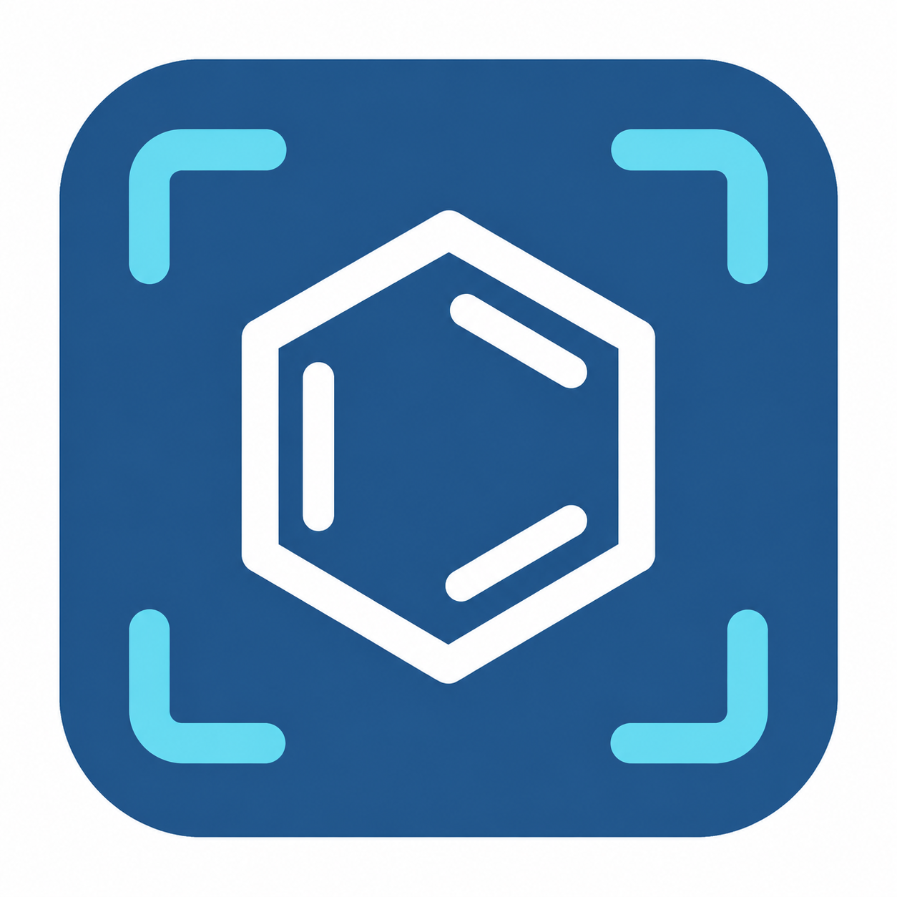

# MolRecognizer icon concept



A white aromatic ring represents molecular structures; cyan scan-frame corners
represent recognition from a screenshot. The deep blue follows the workbench
palette. Broad strokes and no lettering prioritize a recognizable silhouette
at desktop/taskbar sizes.

Status: approved design, now implemented as a clean vector master and transparent
Windows icon. The original concept above was generated with the built-in
image-generation tool using the imagegen skill. It remains unchanged as the
design reference, with its opaque white outer background.

Production assets live in `src/molrecognizer/gui/icons/`:

- `molrecognizer.svg`: editable vector master, following the approved design.
- `molrecognizer.png`: transparent 1024-pixel export.
- `molrecognizer.ico`: independently rendered 16, 20, 24, 32, 40, 48, 64, 96,
  128 and 256-pixel frames, with transparent corners.

Run `python packaging/windows/export_icon.py` to regenerate PNG/ICO exports
using the project's Qt/Pillow dependencies. No image-generation service is
needed to rebuild these assets. The icon is used by the GUI and Windows
executables; a copy is also included beside the portable EXE for shortcuts.

## Original generation prompt

```text
Use case: logo-brand.
Asset type: a single original Windows desktop application icon for MolRecognizer, a chemistry application that recognizes molecular structures from screenshots and lets scientists edit them.
Primary request: an exceptionally clear, memorable icon combining a chemical ring with image-recognition framing. Deliver the icon artwork itself, not a mockup or a presentation sheet.
Composition: one centered rounded-square deep-blue tile, occupying about 90% of a square 1024x1024 canvas, with genuinely transparent pixels outside its rounded silhouette. Inside the tile, a large bold white six-sided chemical ring with three short, clearly separated alternating inner bond strokes. Surround the ring with four simple cyan L-shaped scan-frame corners, with generous clear blue space separating the frame from the molecule. The ring is the dominant focal point. The overall geometry is optically balanced and uncluttered; broad consistent strokes, clean joins, smooth antialiasing. Ring about 45% of full canvas height; scan frame about 68%. Visually robust at Windows taskbar sizes such as 32 and 48 pixels.
Style: refined modern scientific software identity, flat vector-like graphic rendered as a high-resolution bitmap. Confident, clean, precise, friendly. Use the existing application's palette: deep blue approximately #285A89, pure white molecular ring, light cyan approximately #70D9EC recognition corners. Solid color fills, no gradient, no bevel, no metallic or glass effects, no drop shadow.
Text: none. Do not include the application name, letters, chemical labels, numbers or a monogram.
Avoid: QR code patterns, orbital atom symbols, a magnifying glass, camera silhouette, AI sparkles, tiny scattered nodes, complex molecules, extra badges, extra borders, check marks, decorative details, multiple options, mockups, watermarks. Keep real transparency outside the blue tile, not a painted checkerboard.
Output: one polished standalone app icon with a strong silhouette.
```

## Final refinement prompt

The first generated image was the edit target.

```text
Use case: precise-object-edit / logo-brand.
Edit target: the provided MolRecognizer app icon. Keep its exact design concept, proportions and arrangement: a white benzene-ring symbol with three alternating inner bonds, surrounded by four cyan scan-frame corners inside a deep-blue rounded square. No text.
Make one cleanup change: remove ALL grain, mottling, cloudy gradients, dark smudges, stray pixels, uneven transparency and colored fringes. The blue tile interior must be a completely uniform solid #285A89. The ring is uniform solid white. The four scan corners are uniform solid #70D9EC. Smooth, precise, antialiased vector-like edges only. No glow, shadows, bevel, texture or noise.
For this clean design master, replace the outside transparency with a perfectly plain opaque white canvas. The only visible artwork must be the centered blue rounded square and its existing molecule/scan symbol. Preserve ample white clearance around the complete blue tile, about 5% each side. No framing, mockup, legend or extra symbols. Single square icon image.
```
